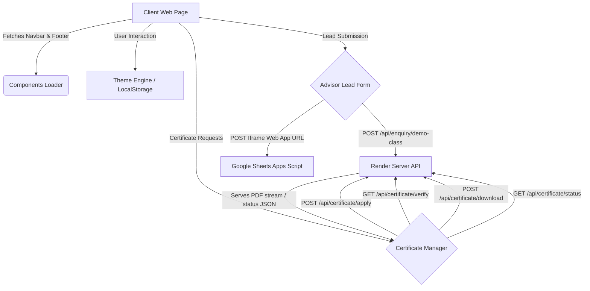

# SSSAM Academy Frontend

SSSAM Academy is a modern, high-performance, and visually stunning web application for a premier computer education and training institute located in Old DLF Colony, Sector 14, Gurugram, Haryana, India. The platform is designed with rich aesthetics, seamless animations, fully responsive layouts, SEO-optimized structures, and robust integrations with backend APIs and Google Workspace services.

---

## 🌟 Features

*   **Sleek Multi-Slide Hero Carousel**: Fluid, auto-rotating hero slides on the homepage (5-second intervals) featuring high-contrast text overlays, call-to-actions, and manual navigation triggers.
*   **Dynamic Component Injection**: Seamless client-side fetching and injecting of shared components (`navbar.html` and `footer.html`) to facilitate a modular, maintainable structure without single-page application (SPA) overheads.
*   **Responsive Theme Engine**: Full support for Dark and Light modes, persisting user selection in `localStorage` across browsing sessions.
*   **Advanced Certificate Management Suite**:
    *   **Apply**: Submit structured student enrollment info for a new certificate with real-time field validation.
    *   **Status Check**: Query application review progress in real-time.
    *   **Verification**: Publicly verify the legitimacy of issued credentials using unique certificate IDs.
    *   **Secure Download**: Retrieve certified, tamper-proof PDF documents directly as binary streams and download them client-side.
*   **Interactive Advisor Lead Widget**: A multi-variant enquiry form supporting popup and static modes, enforcing 10-digit phone number validations, and syncing directly with backend endpoints.
*   **Automated Demo Popup**: On-scroll or time-delayed popup (5 seconds) on the home page designed to capture quick enquiries.
*   **Google Sheets Lead Mapping**: Direct fallback logging of course enquiries from the About page to a target Google Spreadsheet utilizing a custom Google Apps Script web app hook.
*   **Immersive Micro-Animations**: Advanced UI transitions powered by **GSAP (GreenSock Animation Platform)** and **ScrollTrigger**, featuring mouse-tracking feature/course cards, bounce reveals, and staggered entry animations.
*   **LocalBusiness & FAQ SEO Schemas**: Embedded JSON-LD structured schemas, geo-tagging metadata (IN-HR, coordinates: `28.4703; 77.0418`), canonical link tags, and preloaded banner assets for maximum performance and crawlability.

---

## 🛠️ Tech Stack & Dependencies

*   **Core**: HTML5 (Semantic Structure) & JavaScript (ES6+ Modules)
*   **Styling**: Vanilla CSS3 using custom properties (variables) for theme consistency and layout control
*   **Motion & Effects**: GreenSock Animation Platform (GSAP [v3.12.2](https://cdnjs.cloudflare.com/ajax/libs/gsap/3.12.2/gsap.min.js)) & ScrollTrigger ([v3.12.5](https://cdnjs.cloudflare.com/ajax/libs/gsap/3.12.5/ScrollTrigger.min.js)) (CDN-loaded)
*   **Notifications**: Toastify-js (CDN-loaded with styles) for responsive notifications
*   **Utilities**: PDF-Lib (`^1.17.1`) specified in `package.json` for PDF loading/modifying operations
*   **Icons**: FontAwesome [v6.5.0](https://cdnjs.cloudflare.com/ajax/libs/font-awesome/6.5.0/js/all.min.js) (CDN-loaded)

---

## 📂 Project Structure

```
frontend/
├── .vscode/
├── assets/
│   ├── courses/                  # 38 course icons/images (e.g., ADCA.png, AWS.png, etc.)
│   ├── gallery/                  # Gallery images (photo1.jpeg to photo6.jpg)
│   ├── Contact_page.png
│   ├── about_page.png
│   ├── admission_page.png
│   ├── computer-institute-gurugram-banner.png
│   ├── data.jpg
│   ├── home_page.png
│   ├── job-oriented-it-courses-gurugram.png
│   ├── job-ready-training-gurgaon.png
│   ├── logo.png
│   ├── logo1.png
│   ├── placement-support-institute-gurugram.png
│   ├── sssam.png
│   └── tech.jpg
├── components/
│   ├── about.css                 # Story animations & styling for the About page
│   ├── about.js                  # Apps Script submit handler & Story animations
│   ├── admission.css             # Layouts for admission forms
│   ├── admission.js              # Admission form triggers
│   ├── certificate.css           # Forms layout for Certificate suite
│   ├── certificate.js            # Operations for Apply, Verify, Status, & Download APIs
│   ├── contact.css               # Interactive mapping & contact forms styling
│   ├── contact.js                # Contact map hover effects
│   ├── course.css                # Visual templates for course details
│   ├── course.js                 # Course specific hover animations
│   ├── courses.css               # Styling rules for course category grids
│   ├── courses.js                # Course search filter & motion controls
│   ├── enquiry-form.js           # Multi-variant lead generation widget (popup & static)
│   ├── footer.html               # Shared footer structure
│   ├── navbar.html               # Shared navigation header structure
│   ├── script.js                 # Shared component loader & theme manager
│   └── style.css                 # Central styling tokens and color vars
├── courses/                      # 37 HTML specialized course brochures, including:
│   ├── Tally.html
│   ├── adca.html
│   ├── advanced-excel.html
│   ├── ai-ml.html
│   ├── autocad-course-in-gurugram.html
│   ├── aws-cloud-course-gurugram.html
│   └── ... (additional course pages)
├── google-apps-script/
│   └── demo-form-to-sheet.gs     # Google Apps Script for syncing enquiries to Google Sheets
├── .gitignore
├── README.md
├── about.html                    # About Us Page
├── admission.html                # Course Admission Form
├── apply-certificate.html        # Apply for Certificate Request Portal
├── certificate.html              # Certificate Landing Page
├── check-application-status.html # Query Application Status Page
├── contact.html                  # Contact Us Page with Embed Map
├── courses.html                  # Comprehensive Courses Grid Catalog
├── download-certificate.html     # Retrieve Certificate PDF Portal
├── index.html                    # Academy Homepage with Carousel & FAQ
├── package.json                  # Node environment dependencies
├── package-lock.json
├── script.js                     # Homepage carousel and GSAP animation controller
├── style.css                     # Homepage styles override
├── temp_faq.css                  # FAQ-specific styling rules
└── verify-certificate.html       # Public Certificate Verification Portal
```

---

## ⚙️ Environment & Configuration

External API hosts and sheets mapping values are configured directly in the files:

1.  **Backend API Endpoint** (`components/certificate.js`, `components/enquiry-form.js`, `script.js`):
    *   `BASE_URL`: Points to the deployed Render server or localhost API.
    *   *Default*: `https://sssam.onrender.com`
    *   *Note*: In `components/certificate.js`, it can also be configured dynamically by setting `window.APP_BASE_URL` prior to script initialization.
2.  **Google Apps Script Web App URL** (`components/about.js`):
    *   `DEMO_SHEET_WEB_APP_URL`: Configure this variable with your deployed Apps Script URL.
    *   *Default*: `https://script.google.com/macros/s/AKfycbz7e3JMuZR23ulfmMXyii56sop28a-tihJk-7WnrEWQ6r0GYNOcrr4Af1hx5n6vK8N4/exec`
3.  **Google Spreadsheet Identifiers** (`google-apps-script/demo-form-to-sheet.gs`):
    *   `SPREADSHEET_ID`: Target Google Sheets identifier (`1ZY3URfI9WyK4yPQqrAzWvSKRFuAv-khWn7_vkatkog8`).
    *   `SHEET_NAME`: Sheet name where data will be stored (`Demo Booking Data`).

---

## 🔌 API Documentation

The frontend integrates with the following REST API endpoints:

### 1. Certificate System

#### **Apply Certificate**
*   **Endpoint**: `POST /api/certificate/apply`
*   **Payload (JSON)**:
    ```json
    {
      "fullName": "John Doe",
      "phoneNumber": "9876543210",
      "email": "johndoe@example.com",
      "dateOfBirth": "2000-01-01",
      "address": "123 Main St, Sector 14, Gurugram",
      "course": "Data Science",
      "certificateType": "Training",
      "duration": "3 Months"
    }
    ```
*   **Response (JSON)**:
    ```json
    {
      "success": true,
      "applicationId": "APP4829",
      "message": "Application Submitted Successfully"
    }
    ```

#### **Verify Certificate**
*   **Endpoint**: `GET /api/certificate/verify?certificateNumber={number}`
*   **Response (JSON)**:
    ```json
    {
      "success": true,
      "studentName": "John Doe",
      "course": "Data Science",
      "duration": "3 Months",
      "certificateNumber": "SSSAM-DS-1002",
      "issueDate": "2026-06-18",
      "instituteName": "SSSAM Academy",
      "status": "Verified"
    }
    ```

#### **Download Certificate**
*   **Endpoint**: `POST /api/certificate/download`
*   **Payload (JSON)**:
    ```json
    {
      "certificateNumber": "SSSAM-DS-1002",
      "dateOfBirth": "2000-01-01"
    }
    ```
*   **Response**: `application/pdf` binary stream or JSON message fallback on failure.

#### **Check Application Status**
*   **Endpoint**: `GET /api/certificate/status/{applicationId}`
*   **Response (JSON)**:
    ```json
    {
      "success": true,
      "name": "John Doe",
      "course": "Data Science",
      "certificateType": "Training",
      "status": "Approved",
      "certificateNumber": "SSSAM-DS-1002",
      "issueDate": "2026-06-18"
    }
    ```

### 2. Lead & Enquiry System

#### **Submit Demo Class Request**
*   **Endpoint**: `POST /api/enquiry/demo-class`
*   **Payload (JSON)**:
    ```json
    {
      "fullName": "Jane Doe",
      "phoneNumber": "9876543211",
      "course": "Ethical Hacking",
      "customCourseName": "",
      "demoType": "Offline (Gurugram)",
      "message": "Looking forward to attending the demo class."
    }
    ```
*   **Response (JSON)**:
    ```json
    {
      "success": true,
      "message": "Enquiry submitted successfully"
    }
    ```

---

## 🎨 Architecture & Data Flow



---

## 🚀 Installation & Setup

1.  **Clone the Repository**:
    ```bash
    git clone https://github.com/your-username/sssam-frontend.git
    cd sssam-frontend
    ```

2.  **Install Dependencies**:
    While this is primarily a static client-side project, you can install the configuration dependencies using `npm`:
    ```bash
    npm install
    ```

3.  **Run Locally (Dev Server)**:
    Start a local development server to test pages dynamically:
    ```bash
    # Run using http-server via npx
    npx http-server -p 3000
    ```
    Open `http://localhost:3000` in your web browser.

---

## 🧪 Testing

1.  **API verification**:
    To mock and test the API endpoints, you can execute curl statements:
    ```bash
    curl -X POST https://sssam.onrender.com/api/enquiry/demo-class \
         -H "Content-Type: application/json" \
         -d '{"fullName":"Test User","phoneNumber":"9999999999","course":"SEO","demoType":"Online"}'
    ```

2.  **UI & Schema Validation**:
    Open the browser developer tools (`F12`) to verify the dynamic schema loading indicators and check responsive logs during page load. Look for confirmation outputs:
    ```javascript
    console.info('LocalBusiness schema loaded:', window._localBusinessSchema);
    ```

---

## 🚢 Deployment

### Static Hosting (Vercel / Netlify / GitHub Pages)
Since this is a static frontend repository, deployment is quick:

1.  **Vercel**:
    ```bash
    npm install -g vercel
    vercel
    ```
2.  **GitHub Pages**:
    Push the contents of the workspace directory directly to your `gh-pages` branch.

Ensure the environment variables/config URLs inside `components/` match your production API hosts prior to building.

---

## 🤝 Contributing & Guidelines

1.  Keep components inside the `/components` directory isolated and styled using the standard theme variables defined in `/components/style.css`.
2.  Maintain standard HTML5 semantic elements in all static course configurations.
3.  Ensure page titles, meta descriptions, and schema attributes are updated when introducing new course brochures to the `courses/` directory.

---

## 📄 License & Authors

*   **Author**: SSSAM Academy
*   **License**: Proprietary / Private. All rights reserved.
